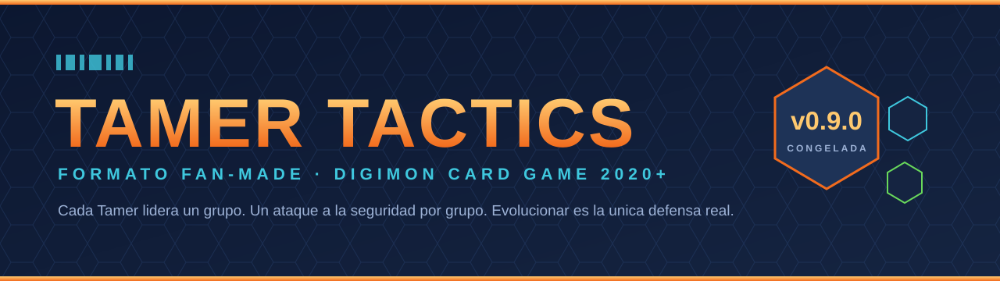
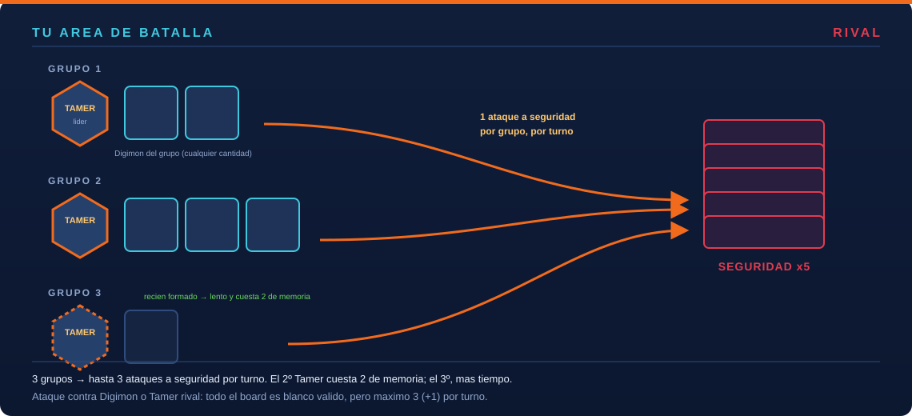
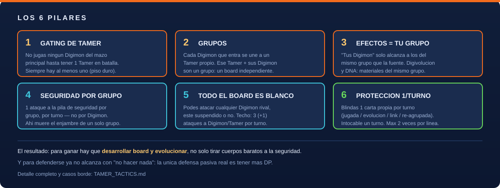
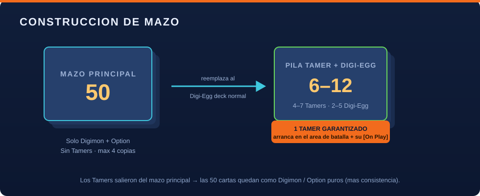
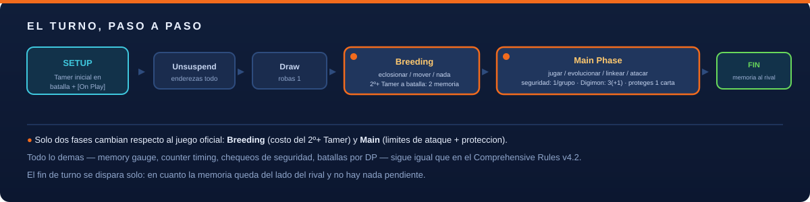
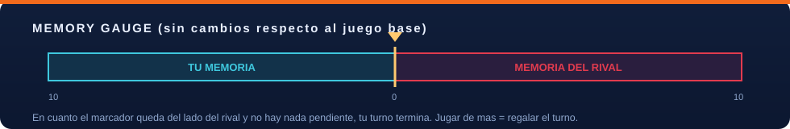

<div align="center">



<br>

[](TAMER_TACTICS.md)
[](OPEN_ITEMS.md)
[](2020-edition/RULES.md)
[](2020-edition/pdfs/)
[](#-créditos-y-aviso-legal)
[](#)

### Un formato casero para el Digimon Card Game donde **cada Tamer lidera un grupo**, solo se puede atacar la seguridad **una vez por grupo**, y la única defensa pasiva real es **evolucionar**.

*Sin prohibir una sola carta.*

</div>

---

## 📑 Contenido

- [¿Por qué existe?](#-por-qué-existe)
- [La idea en 30 segundos](#-la-idea-en-30-segundos)
- [Qué cambia respecto al juego base](#-qué-cambia-respecto-al-juego-base)
- [Los 6 pilares](#-los-6-pilares)
- [Construcción de mazo](#-construcción-de-mazo)
- [El turno, paso a paso](#-el-turno-paso-a-paso)
- [Defensa: por qué ahora hay que evolucionar](#-defensa-por-qué-ahora-hay-que-evolucionar)
- [Preguntas frecuentes](#-preguntas-frecuentes)
- [Estado y hoja de ruta](#-estado-y-hoja-de-ruta)
- [Estructura del repositorio](#-estructura-del-repositorio)
- [Documentos](#-documentos)
- [Créditos y aviso legal](#-créditos-y-aviso-legal)

---

## 🎯 ¿Por qué existe?

En el Digimon Card Game base, la pila de seguridad son **solo 5 cartas**, y el límite de "1 ataque a seguridad" es **por Digimon**. Eso hace que un mazo de **enjambre** — muchos cuerpos baratos, cero desarrollo, cero evolución — pueda cerrar la partida en el turno 3-4 antes de que el juego empiece de verdad. Repetitivo y poco interesante.

**Tamer Tactics** ataca ese problema de raíz, **sin banear nada**:

| | Juego base | Tamer Tactics |
|---|---|---|
| Límite de ataque a seguridad | 1 **por Digimon** | 1 **por grupo liderado por un Tamer** |
| Conseguir más "carriles" de ataque | gratis: jugás otro Digimon | lento y caro: cada Tamer nuevo cuesta tiempo y memoria |
| Defensa pasiva | quedarte quieto (tu Digimon sin suspender no es blanco) | **ninguna** — todo el board es blanco; la única defensa es más DP |

El resultado: para ganar hay que **desarrollar board y evolucionar**, y las partidas duran lo suficiente como para que las decisiones importen.

<div align="center">

`🥚 In-Training` → `🦎 Rookie` → `🦖 Champion` → `🐲 Ultimate` → `⚡ Mega`

</div>

---

## ⚡ La idea en 30 segundos



- Los **Tamers salen del mazo principal** y van a una pila nueva junto con los Digi-Egg.
- Al empezar la partida **ya tenés 1 Tamer en el área de batalla** (y su `[On Play]` se resuelve).
- Cada Digimon que jugás **se une a un Tamer** → forma parte de su **grupo**.
- Cada grupo puede hacer **1 ataque a la seguridad rival por turno**. Más grupos = más ataques… pero el 2.º Tamer cuesta **2 de memoria** y el 3.º cuesta varios turnos.
- Podés atacar **cualquier Digimon o Tamer rival** en todo momento — pero **máximo 3 (+1) por turno**.
- Cada turno podés blindar **1 carta propia**: intocable durante un turno completo.

---

## 🆚 Qué cambia respecto al juego base

Tamer Tactics se apoya **sobre** el Comprehensive Rules Manual v4.2. Todo lo que no está en esta lista funciona **exactamente igual** que en el juego oficial.

| Área | Cambio |
|---|---|
| **Mazo** | Mazo principal de 50 = solo Digimon + Option. Nueva **pila Tamer + Digi-Egg** (4-7 Tamers + 2-5 Digi-Egg, total 6-12). |
| **Arranque** | Cada jugador coloca 1 Tamer directo en el área de batalla en la preparación; su `[On Play]` se resuelve ahí. Sin "turno muerto". |
| **Tamers** | Entran por eclosión, no se juegan de la mano. El 2.º Tamer en adelante cuesta **2 de memoria** para moverlo a batalla. Un Tamer nunca puede digivolucionar a Digimon. **Siempre hay ≥1 Tamer tuyo en batalla** (el último es inmune a la remoción rival). |
| **Grupos** | Cada Digimon que entra al área de batalla se une a un Tamer propio. Los efectos de *"tus Digimon"* solo alcanzan al **mismo grupo**. Digivolución y DNA: **materiales del mismo grupo**. |
| **Ataque a seguridad** | 1 **por grupo**, por turno (antes: 1 por Digimon). |
| **Ataque a Digimon/Tamer** | Cualquier Digimon rival es blanco, suspendido o no. Un Tamer solo si una carta lo habilita. Techo **absoluto de 3 (+1 de keyword) por turno**. |
| **Protección** | 1 carta propia por turno (jugada / evolución / link / re-agrupada) queda **intocable** hasta tu próximo turno. Máx. 2 veces por línea evolutiva. |
| **Legalidad** | Se usa la lista **oficial de Bandai** (Banned / Restricted / Banned Pairs). El formato **no agrega prohibiciones propias**. |

---

## 🏛️ Los 6 pilares



> Cada regla del formato es rastreable a una simulación concreta que la motivó — ver [`TAMER_TACTICS-simulations.md`](TAMER_TACTICS-simulations.md).

---

## 🃏 Construcción de mazo



| Zona | Regla |
|---|---|
| **Mazo principal** | 50 cartas exactas. **Solo Digimon y Option** — los Tamers no van acá. Máx. 4 copias por número de carta. |
| **Pila Tamer + Digi-Egg** | **4-7 Tamers** + **2-5 Digi-Egg**, mezclados. Total 6-12. Reemplaza al Digi-Egg deck normal. |
| **Preparación** | Piedra-papel-tijera → barajar todo → cada quien busca 1 Tamer y lo pone en su área de batalla → resolver su `[On Play]` → robar 5 + mulligan → seguridad → memoria a 0 → turno 1. |

**Consejo de armado:** como los `[On Play]` de los Tamers **sí** funcionan (al entrar a batalla), evaluá cada Tamer por su cuerpo/DP, sus pasivas **y** su `[On Play]`. Todo cuenta.

Detalle completo, requisitos de color y checklist de torneo: [`2020-edition/DECKBUILDING.md`](2020-edition/DECKBUILDING.md).

---

## 🔄 El turno, paso a paso





Solo **dos fases** cambian:

- **Breeding Phase** — sigue siendo 1 sola acción (eclosionar / mover / nada). Novedad: mover el **2.º Tamer o posteriores** de cría a batalla cuesta **2 de memoria**.
- **Main Phase** — jugar, evolucionar, linkear y atacar como siempre, con los límites del formato: **1 ataque a seguridad por grupo**, **3 (+1) ataques a Digimon/Tamer**, y **1 carta protegida**.

El resto (memory gauge, counter timing, block timing, chequeos de seguridad, batallas por DP) es idéntico a [`2020-edition/RULES.md`](2020-edition/RULES.md).

---

## 🛡️ Defensa: por qué ahora hay que evolucionar

En el juego base, un Digimon **sin suspender** no puede ser atacado — así que "no hacer nada" es una defensa válida. En Tamer Tactics eso se elimina: **todo el board rival es blanco válido en todo momento**.

Consecuencias:

- Un solo Digimon **bien evolucionado** (alto DP) es casi invulnerable a un enjambre sin evolucionar — el defensor nunca "gasta" nada al ganar una batalla.
- Desplegar cuerpos y dejarlos quietos deja de tener sentido: o los usás, o son blanco gratis.
- Las keywords defensivas suben de valor: `<Evade>`, `<Barrier>`, `<Decoy>`, `<Blocker>`, `<Guard>`.
- Como contrapeso al "todo es blanco", existen dos válvulas: el **techo de 3 (+1) ataques** por turno, y la **protección de 1 carta** por turno.

---

## ❓ Preguntas frecuentes

<details>
<summary><b>¿Puedo jugar Digimon en el turno 1?</b></summary>

Sí. El Tamer garantizado arranca directamente en el área de batalla durante la preparación, así que desde el primer turno ya podés jugar Digimon del mazo principal.
</details>

<details>
<summary><b>¿Qué pasa si me matan el Tamer de un grupo?</b></summary>

Sus Digimon quedan **huérfanos** y se re-agrupan **de inmediato**, uno por uno, a cualquier otro grupo propio. Un huérfano puede seguir peleando contra Digimon rivales, pero **no puede atacar la seguridad** hasta re-agruparse. Tu **último** Tamer no te lo pueden sacar: es inmune a la remoción rival.
</details>

<details>
<summary><b>¿Los efectos <code>[On Play]</code> de los Tamers funcionan?</b></summary>

**Sí.** Se disparan cuando el Tamer entra al área de batalla — al moverlo de cría a batalla, o al colocarlo en la preparación. (En versiones viejas del formato quedaban muertos; se corrigió en v0.9.0.)
</details>

<details>
<summary><b>¿Puedo digivolucionar usando un Digimon de otro grupo como base?</b></summary>

No. Cada grupo es un **board independiente**: digivolución y DNA Digivolution solo pueden usar materiales del **mismo grupo**.
</details>

<details>
<summary><b>¿Un Blocker solo protege a su grupo?</b></summary>

No — `<Blocker>` redirige el ataque **a sí mismo** y puede interceptar cualquier ataque de cualquier grupo. En cambio `<Decoy>`, `<Guard>`, `<Scapegoat>` y `<Save>` **sí** están acotados a su grupo (su texto dice "otro Digimon propio").
</details>

<details>
<summary><b>¿<code>&lt;Blitz&gt;</code> / <code>&lt;Vortex&gt;</code> / <code>&lt;Execute&gt;</code> / <code>&lt;Engage&gt;</code> saltean el límite de ataques?</b></summary>

No. Entre **todas** esas keywords juntas suman **como máximo +1 ataque** por turno, y ese +1 es siempre aparte de los 3 normales. Techo real: 4 ataques a Digimon/Tamer por turno.
</details>

<details>
<summary><b>¿Qué lista de cartas prohibidas se usa?</b></summary>

La oficial de Bandai para torneos sancionados (`world.digimoncard.com/rule/restriction_card/`). El formato no prohíbe ni restringe ninguna carta por su cuenta.
</details>

---

## 🚦 Estado y hoja de ruta

| | Hito |
|---|---|
| ✅ | **v0.1 → v0.9** — 6 rondas de simulación, 42 escenarios corridos por subagentes independientes. |
| ✅ | **v0.9.0** — pase de revisión de reglas: cerrados los huecos de interacción del sistema de grupos y de las vías de entrada al campo. **Ruleset congelado.** |
| ⏳ | **Mesa real** — 30-50 partidas con jugadores humanos y decklists del meta actual. Lo que hay que medir está en [`OPEN_ITEMS.md`](OPEN_ITEMS.md). |
| ⬜ | **v1.0** — recalibración con datos reales: winrate de primer jugador, curva de "grupos por turno", y los números que hoy están afirmados pero no probados en mesa. |

> ⚠️ **Nota honesta:** todo el playtesting hasta ahora lo corrieron agentes LLM, no jugadores. Sirve para encontrar huecos de reglas; **no** para calibrar balance fino. v0.9.0 es un punto de partida para llevar a la mesa, no un formato "terminado".

---

## 📦 Estructura del repositorio

```
.
├── README.md                     ← estás acá
├── TAMER_TACTICS.md              ← las reglas del formato (v0.9.0, vigentes)
├── TAMER_TACTICS-simulations.md  ← historial de playtesting y el porqué de cada regla
├── OPEN_ITEMS.md                 ← qué falta validar en mesa real
├── assets/                       ← los gráficos de este README (SVG originales)
└── 2020-edition/                 ← el juego base sobre el que se apoya el formato
    ├── RULES.md                  ← reglas oficiales (extracto del Comprehensive Rules v4.2)
    ├── DECKBUILDING.md           ← construcción de mazo oficial + guía de estrategia
    ├── SETS.md                   ← listado cronológico de sets, 2020 → hoy
    └── pdfs/                     ← PDFs oficiales de Bandai (reglamentos, glosario, erratas)
```

---

## 📚 Documentos

| Documento | Para qué sirve |
|---|---|
| **[TAMER_TACTICS.md](TAMER_TACTICS.md)** | Las reglas completas y vigentes del formato. Empezá acá si querés jugar. |
| **[TAMER_TACTICS-simulations.md](TAMER_TACTICS-simulations.md)** | Cómo se llegó a cada regla: qué se probó, qué falló, qué se cambió. Empezá acá si querés entender el *porqué*. |
| **[OPEN_ITEMS.md](OPEN_ITEMS.md)** | Lo que todavía no está validado y los números sujetos a datos de mesa real. Empezá acá si querés ayudar a testear. |
| **[2020-edition/](2020-edition/)** | El reglamento base, la guía de construcción de mazo y el listado de sets. |

---

## 🙏 Créditos y aviso legal

Proyecto de fans, **sin relación, afiliación ni respaldo de Bandai**.

*"Digimon"*, *"Digimon Card Game"*, los nombres de cartas, las keywords y las reglas oficiales citadas son **© Bandai / Toei Animation**. Este repositorio **no incluye arte ni cartas de Bandai**: los gráficos de [`assets/`](assets/) son originales, hechos para este README. Los PDFs en [`2020-edition/pdfs/`](2020-edition/pdfs/) son documentos de reglas que Bandai publica gratuitamente, incluidos solo como referencia.

## 📄 Licencia y uso

El **texto de reglas del formato** (todo el contenido original de este repo: `TAMER_TACTICS*.md`, `OPEN_ITEMS.md`, `README.md` y los SVG de `assets/`) podés usarlo, copiarlo, imprimirlo y modificarlo libremente para jugar, organizar eventos caseros o derivar tu propia variante. Si lo republicás, un crédito y un link de vuelta se agradecen.

<div align="center">
<br>
<sub><b>Tamer Tactics</b> · v0.9.0 · hecho por y para jugadores</sub>
</div>
